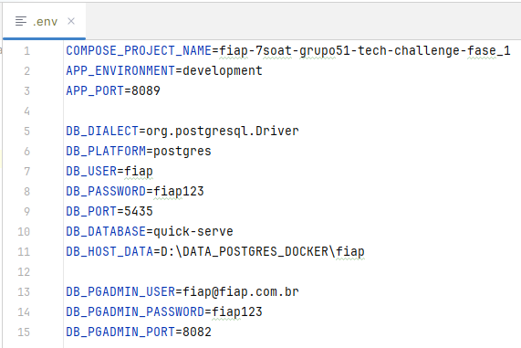

# Projeto Tech Challenge - Fase 1 (Back-End)

## Docker
Segue abaixo passo a passo para rodar o projeto com docker

1. Instale o docker para o seu sistema operacional
2. Certifique-se de que o docker compose também esteja instalado
3. Crie um arquivo .env, com o conteúdo do arquivo .env-docker-compose-sample e preencha as informações conforme seu ambiente. Abaixo um exemplo de preenchimento:

3. Via terminal, entre no diretório raiz do projeto quick-server-api
4. Digite: docker compose up -d

### Serviços configurados

> <b>quick-serve-api</b>
> 
>       Serviço do projeto back-end desenvolvido em Java, que servem as APIs da aplicação
> 
> <b>quick-serve-db</b>
> 
>       Serviço do banco de dados postgres
> 
> <b>quick-serve-pgadmin</b>
> 
>       Serviço do app pgadmin, para acessarmos o banco de dados através de uma interface amigável

### Documentação Swagger

Após subir a API, a documentação Swagger ficará disponibilizado em:

>       http://localhost:30081/swagger-ui/index.html#/
 
